
  
### Rebecca Hutchinson

  

    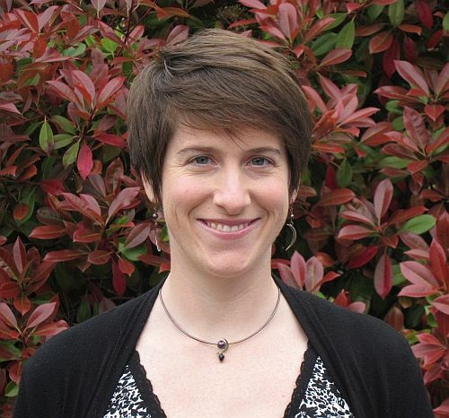
    

    
<a href="mailto:rah@oregonstate.edu">Email</a>  <a href="https://scholar.google.com/citations?user=1pnbx9QAAAAJ&hl=en">Google Scholar</a> 
    <a href="https://www.linkedin.com/in/rebecca-hutchinson-56567753/">LinkedIn</a> 

    

  

  

    Rebecca is the lead PI of the ML QuESt Lab. 
    She is an Associate Professor at <a href="https://oregonstate.edu">Oregon State University</a>, with a joint appointment across the <a href="https://engineering.oregonstate.edu/EECS">School of Electrical Engineering and Computer Science</a> and the <a href="https://fwcs.oregonstate.edu/">Department of Fisheries, Wildlife, and Conservation Sciences</a>. 
    She is also affiliated with the <a href="https://cqls.oregonstate.edu/">Center for Quantitative Life Sciences</a> and the <a href="https://engineering.oregonstate.edu/CoRIS">Collaborative Robotics and Intelligent Systems (CoRIS) Institute</a>. 
    She became interested in interdisciplinary work in machine learning and quantitative ecology during her postdoctoral studies with the <a href="https://computational-sustainability.cis.cornell.edu/">Institute for Computational Sustainability</a> and as an NSF SEES Fellow, advised by <a href="https://web.engr.oregonstate.edu/~tgd/">Tom Dietterich</a> and <a href="https://flel.forestry.oregonstate.edu/">Matt Betts</a>. 
    Prior to that, she completed her PhD at <a href="https://csd.cmu.edu/">Carnegie Mellon University</a> with <a href="http://www.cs.cmu.edu/~tom/">Tom Mitchell</a>.
  
  

### Laurel Hopkins, MS 2018

  

  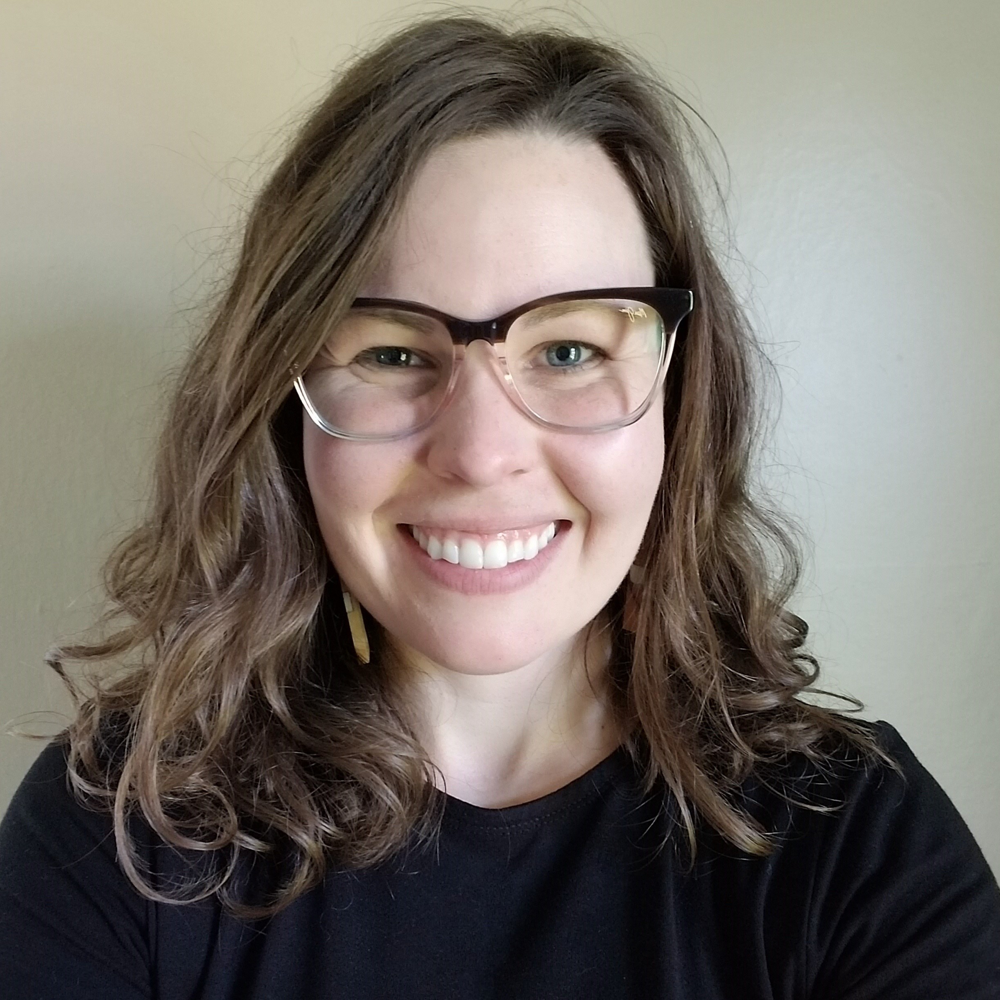
  

  

    Laurel is a PhD student and NASA FINESST (Future Investigators in NASA Earth and Space Science Technology) recipient. Laurel's work is at the intersection of deep  learning, remote sensing, and ecology. She studies deep learning architectures and various remote sensing products (i.e., satellite imagery datasets).
  

### Jing Wang

 

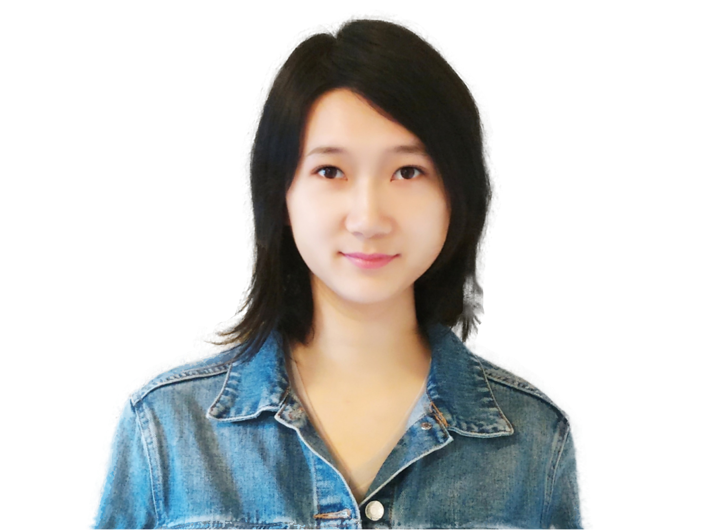

<a href="mailto:wangji9@oregonstate.edu">Email</a> 
<a href="https://www.linkedin.com/in/jingw29/">LinkedIn</a>

Jing is a PhD candidate in computer science, studying on model evaluation in machine learning, specifically developing cross-validation methods for geospatial problems and applying them on birds and housing datasets. Previously, she obtained her M.S. in Computer Science from University of South Carolina, M.A. in Applied Economics from Fudan University, and B.A in Finance from Huazhong University of Science and Technology. 

### Nahian Ahmed

Nahian is a PhD student of computer science. He studies machine learning, with a focus on evaluation, and applications in computational sustainability. He is interested in intuitive and engaging ways of learning about machine learning.

  

### Andrew Droubay

TBA

### Louise Henderson

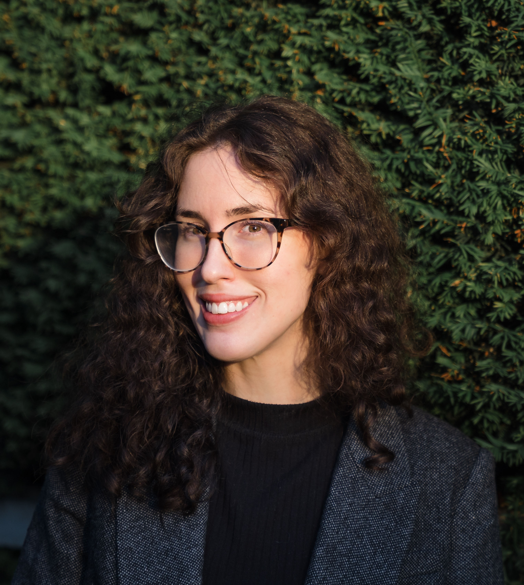

Louise is pursuing an M.S. and a Ph.D. in artificial intelligence at Oregon State University. She received a B.S. in physics, and later a B.S. in computer science, also from Oregon State University. Prior to attending graduate school, Louise worked as a software engineer, developing software to support manufacturing processes and automation.

## Honorary Members

Jupiter 
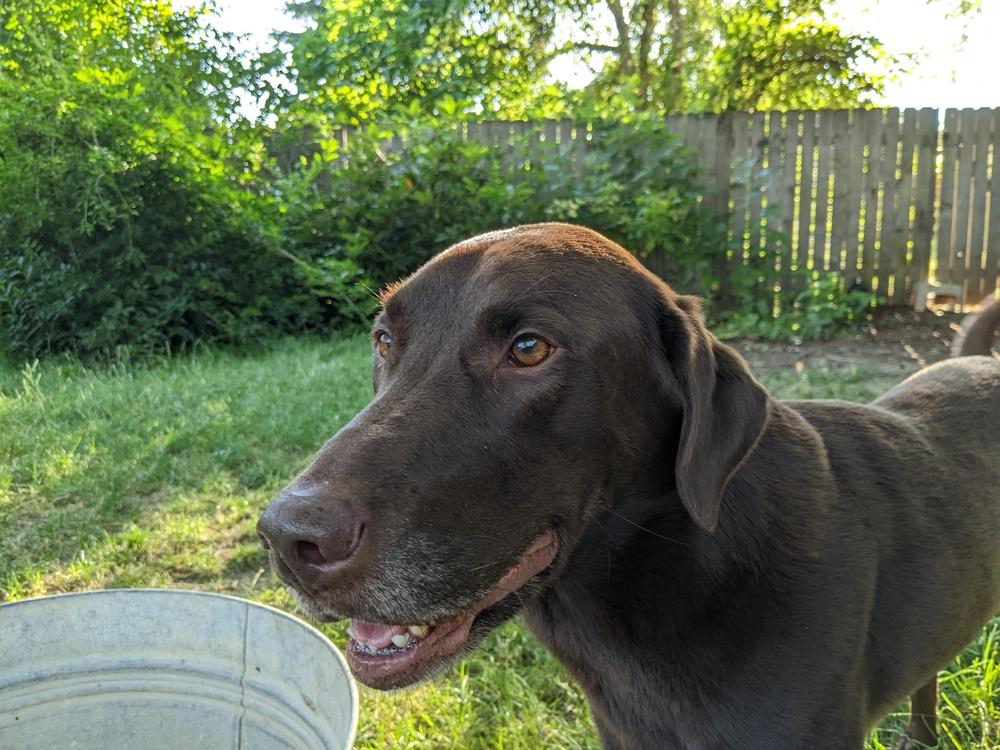 

Cosmo 
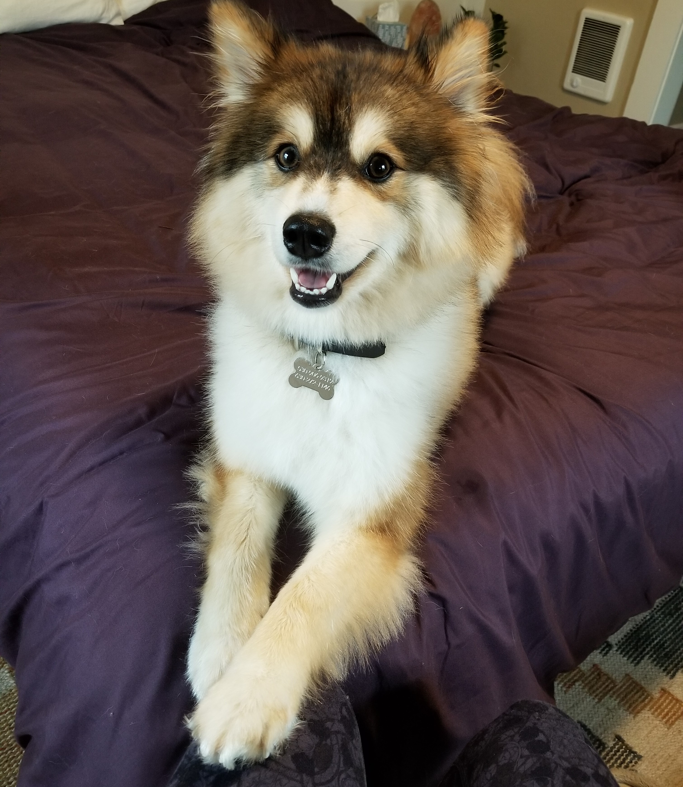

Benny 
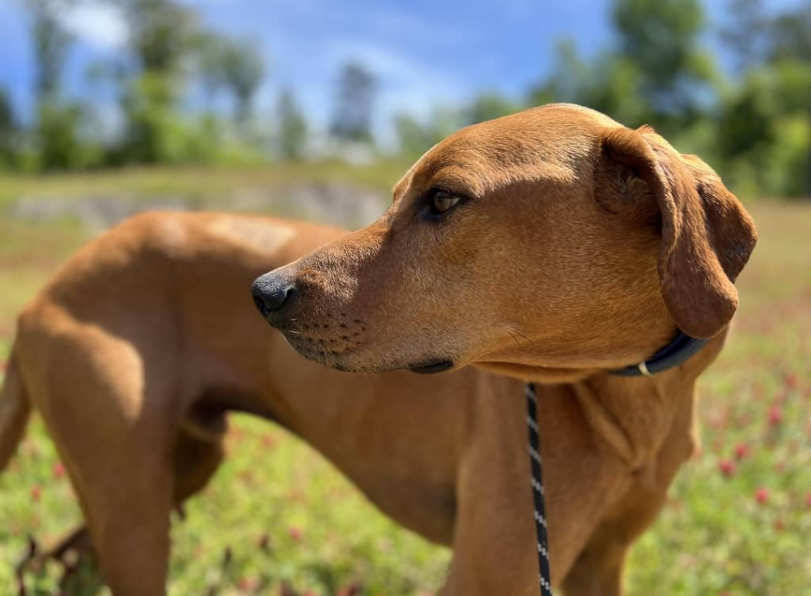

Leo and Lucy 
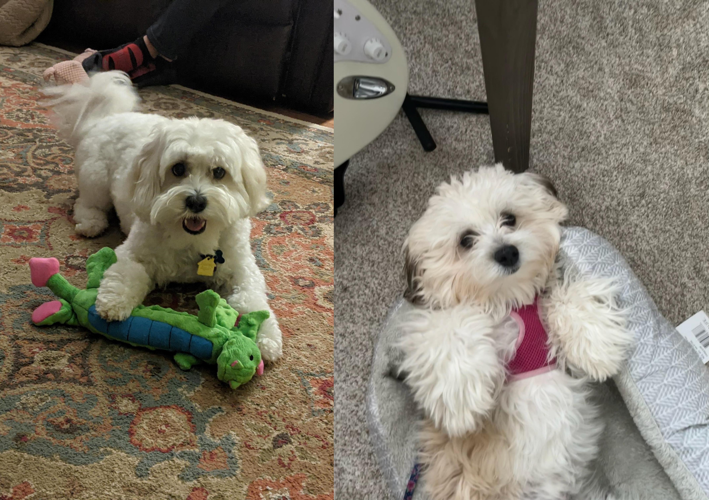

## Alumni

### Mark Roth, MS 2021
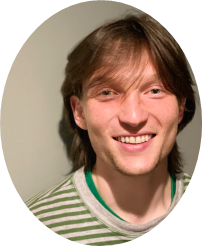

### Eugene Seo, PhD 2021
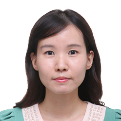

### Vishnupriya Nochikaduthekkedath Reghunathan, MEng 2020
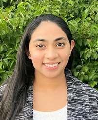

### Liqiang He, MS 2017
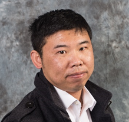

