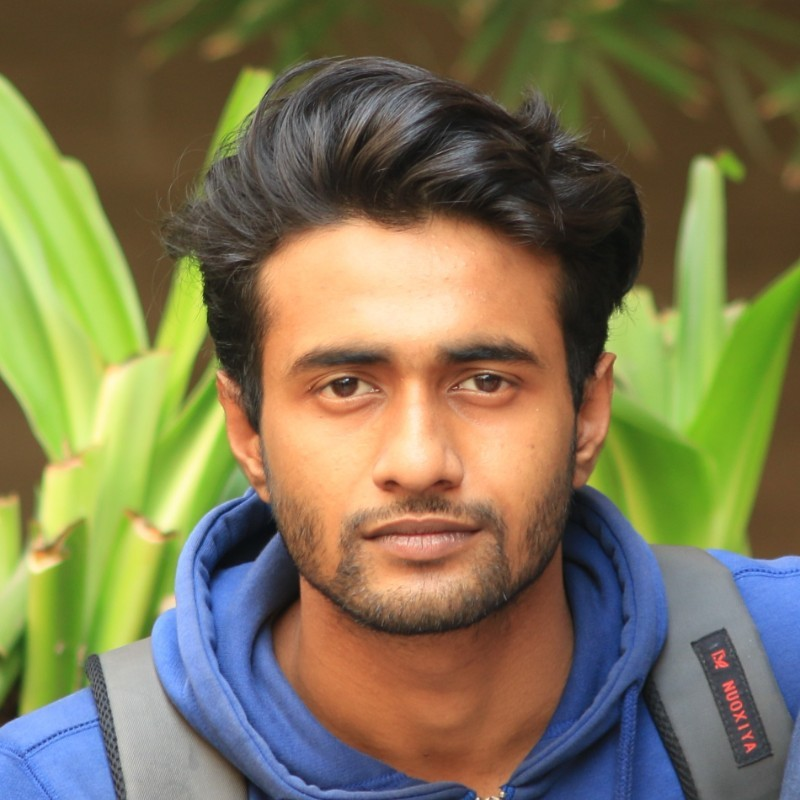
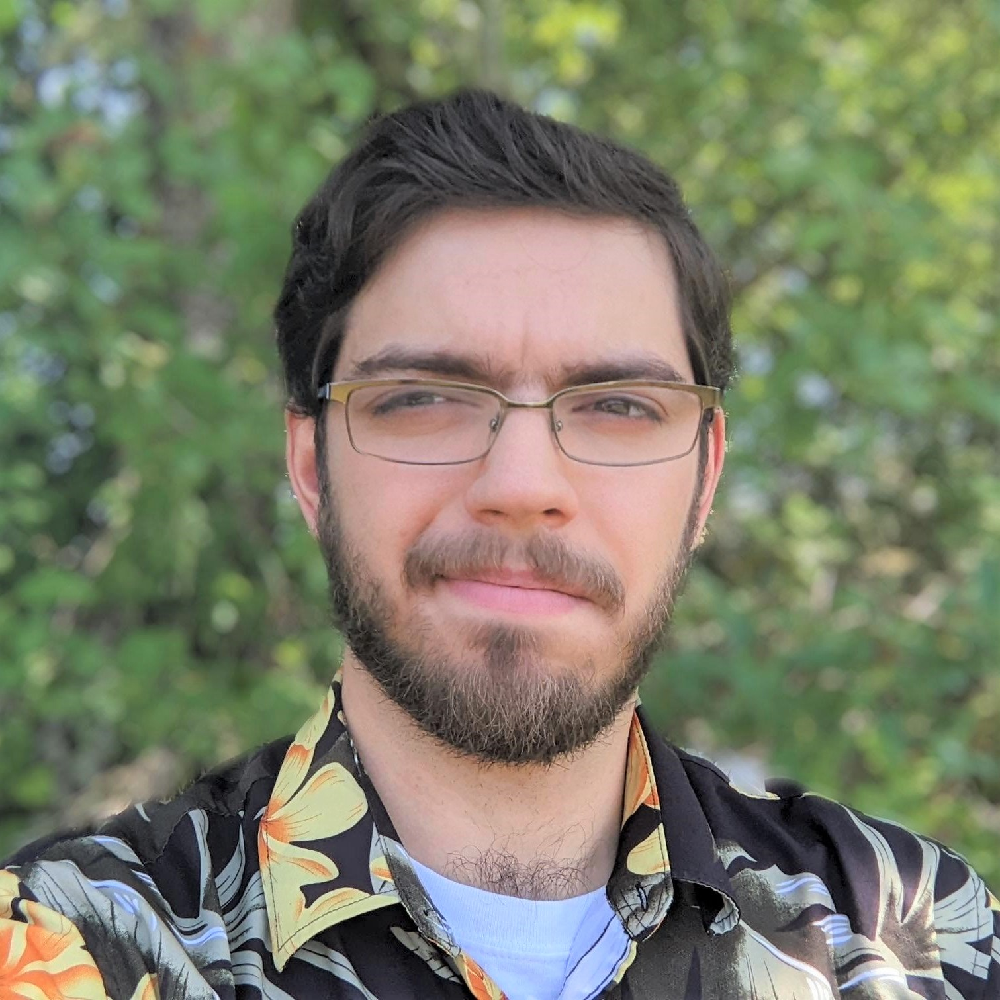
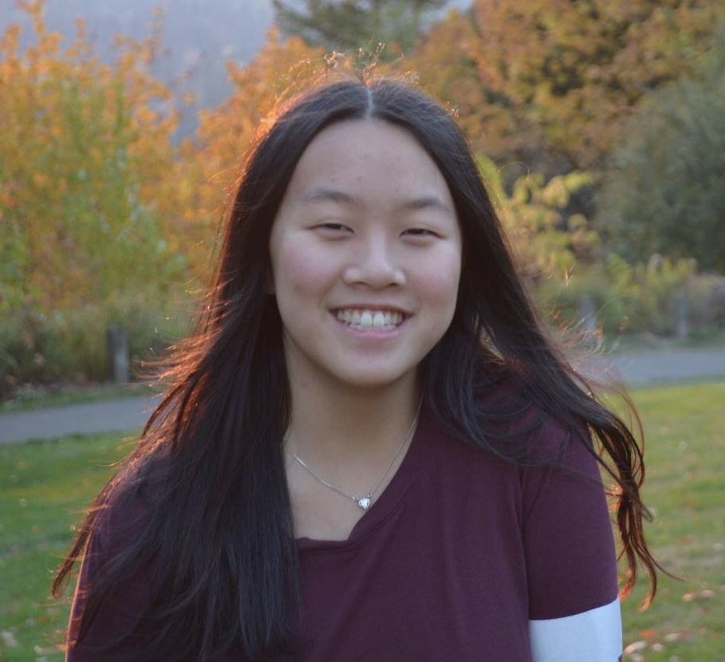
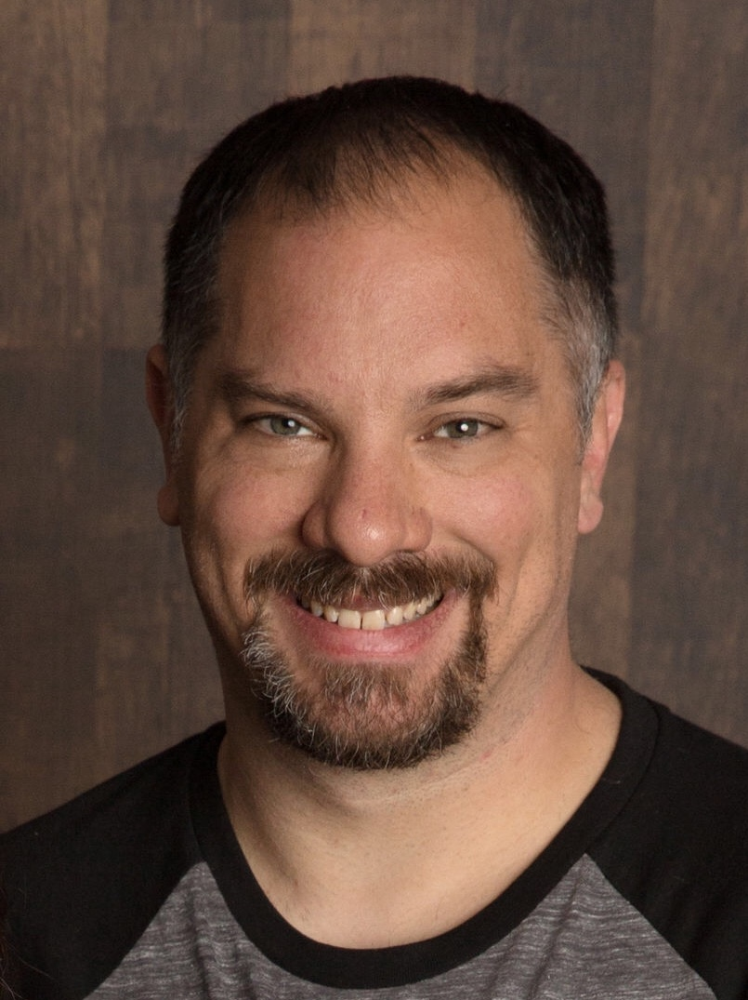

  
### Rebecca Hutchinson

  

    
      

        <a href="mailto:rah@oregonstate.edu"><!--<i class="fa fa-fw fa-envelope-square" aria-hidden="true"></i> -->Email</a>  
        <a href="https://scholar.google.com/citations?user=1pnbx9QAAAAJ&hl=en"><!--<i class="ai ai-google-scholar-square ai-fw"></i> -->Google Scholar</a> 
        <a href="https://www.linkedin.com/in/rebecca-hutchinson-56567753/"><!--<i class="fa fa-fw fa-linkedin" aria-hidden="true"></i> -->LinkedIn</a> 
       

  

  

    Rebecca is the lead PI of the ML QuESt Lab. 
    She is an Associate Professor at <a href="https://oregonstate.edu">Oregon State University</a>, with a joint appointment across the <a href="https://engineering.oregonstate.edu/EECS">School of Electrical Engineering and Computer Science</a> and the <a href="https://fwcs.oregonstate.edu/">Department of Fisheries, Wildlife, and Conservation Sciences</a>. 
    She is also affiliated with the <a href="https://cqls.oregonstate.edu/">Center for Quantitative Life Sciences</a> and the <a href="https://engineering.oregonstate.edu/CoRIS">Collaborative Robotics and Intelligent Systems (CoRIS) Institute</a>. 
    She became interested in interdisciplinary work in machine learning and quantitative ecology during her postdoctoral studies with the <a href="https://computational-sustainability.cis.cornell.edu/">Institute for Computational Sustainability</a> and as an NSF SEES Fellow, advised by <a href="https://web.engr.oregonstate.edu/~tgd/">Tom Dietterich</a> and <a href="https://flel.forestry.oregonstate.edu/">Matt Betts</a>. 
    Prior to that, she completed her PhD at <a href="https://csd.cmu.edu/">Carnegie Mellon University</a> with <a href="http://www.cs.cmu.edu/~tom/">Tom Mitchell</a>.
  
  

## Current Students

### Laurel Hopkins, MS 2018

  

    
    

      <a href="mailto:hopkilau@oregonstate.edu">Email</a>  
      <a href="https://www.linkedin.com/in/laurelhopkins/">LinkedIn</a>
   

  

  

    Laurel is a PhD student and NASA FINESST (Future Investigators in NASA Earth and Space Science Technology) recipient. Laurel's work is at the intersection of deep  learning, remote sensing, and ecology. She studies deep learning architectures and various remote sensing products (i.e., satellite imagery datasets). She recieved her M.S. in Computer Science from Oregon State and her B.S. in Electrical Engineering from UC Santa Barbara. Between her undergraduate and graduate studies, Laurel worked at a medical device startup where she designed the system electronics.
  

### Jing Wang

 

  
  

    <a href="mailto:wangji9@oregonstate.edu">Email</a>  
    <a href="https://www.linkedin.com/in/jingw29/">LinkedIn</a>
   

  

    Jing is a PhD candidate in computer science, studying on model evaluation in machine learning, specifically developing cross-validation methods for geospatial problems and applying them on birds and housing datasets. Previously, she obtained her M.S. in Computer Science from University of South Carolina, M.A. in Applied Economics from Fudan University, and B.A in Finance from Huazhong University of Science and Technology. 
  

### Nahian Ahmed

  

    
  

  

    Nahian is a PhD student of computer science. He studies machine learning, with a focus on evaluation, and applications in computational sustainability. He is interested in intuitive and engaging ways of learning about machine learning.
  

### Andrew Droubay

  

    
  

  

    Andrew is a MS and PhD student in Computer Science researching machine learning for forecasting and anomaly detection problems. He takes inspiration from ecology and sustainability applications to develop novel learning models, with a particular interest in problems across space and time. Co-advised by <a href="https://web.engr.oregonstate.edu/~wongwe/">Weng-Keen Wong</a>, Andrew is a team member of both the <a href="https://agaid.org/">Agriculture for AI (AgAID) Institute</a> and of the <a href="https://www.ppicenter.org/">Pervasive Personalized Intelligence (PPI) Center</a>. Previously, he earned a BS in Computer Science and Mathematics at Roanoke College, where he also worked as a web developer.
  

### Louise Henderson

  

    
  

  

  Louise is pursuing an M.S. and a Ph.D. in artificial intelligence at Oregon State University. She received a B.S. in physics, and later a B.S. in computer science, also from Oregon State University. Prior to attending graduate school, Louise worked as a software engineer, developing software to support manufacturing processes and automation.
  

## Alumni

### Chelsea Li, BS 2023

  

    

  <a href="https://www.linkedin.com/in/chelsea-li-86b6b5188/">LinkedIn</a> 
     

  

  

  Chelsea graduated with a bachelor's degree in Computer Science from Oregon State University in 2023, with a focus on web and mobile application development. During her first year as an undergraduate research assistant at the ML QuESt Lab, she worked on hyperparameter tuning methods and evaluation metrics. Later on, Chelsea interned at Lucidyne Technologies, Inc., where she worked on computer vision applications; Amazon AWS Elemental, where she focused on computer networks and broadcasting services; and Microsoft, where she contributed to containerization methods and data ingestion for Bing's backend processes. After graduating, she accepted a software engineering position at Microsoft's Bing department.
  

### Mark Roth, MS 2021

  

  

  

  Mark graduated with a masters degree in Computer Science from Oregon State University in 2021 where he studied unsupervised machine learning algorithms and how they can improve species distribution models in the context of community-science collected data. His research centered on biodiversity and he completed parallel coursework in conservation and machine learning to better understand the interdisciplinary challenges of his research problem. After graduation, Mark accepted a role as a Data Scientist at <a href="https://www.climate.com">Climate</a>, an agricultural technology company.
  

### Eugene Seo, PhD 2021

  

    

        <a href="mailto:eugene_seo@brown.edu">Email</a>  
        <a href="https://scholar.google.com/citations?user=o8Bwi3EAAAAJ&hl=en">Google Scholar</a> 
        <a href="https://www.linkedin.com/in/eugene-seo/">LinkedIn</a> 
       

  

  

  Eugene earned a Ph.D. degree in Computer Science from Oregon State University in 2021. During her Ph.D. study, she focused on proposing machine learning frameworks for predicting plant-pollinator interactions and modeling bird species distributions. Following graduation, as a Postdoctoral Research Associate at Brown University, she studied machine learning models to estimate aboveground biomass density using Global Ecosystem Dynamics Investigation (GEDI) data.
  

### Vishnupriya NR, MEng 2021

  

 

        <a href="https://www.linkedin.com/in/vishnupriyanr/">LinkedIn</a> 
   

  

  

  Vishnu completed her master's degree in Computer Science, specializing in Machine Learning and Statistics, at Oregon State University in 2021. During her studies, she worked on analyzing over-dispersed count data in species distribution modeling. After graduation, Vishnu joined the Sam's Club AI Labs, Walmart, as an ML Software/Data Engineer, focusing on data pipelines and enhancing the communication aspects of AI systems.
 

### Justin Clarke, BS 2019

  

  

  

  Justin Clarke earned his BS in computer science from Oregon State University with a focus on modeling interactions between species in ecological networks. He later interned at NASA’s Ames Research Center where he developed methods to explain decisions made by deep neural networks in UAV navigation. Justin went on to continue his education as an MS/PhD student in computer science at the University of Massachusetts, Amherst, with research focuses on causal inference, explainability, and generalization. 
 

### Liqiang He, MS 2017

## Honorary Members

Jupiter 
 

Cosmo 

Benny 

Leo and Lucy 

