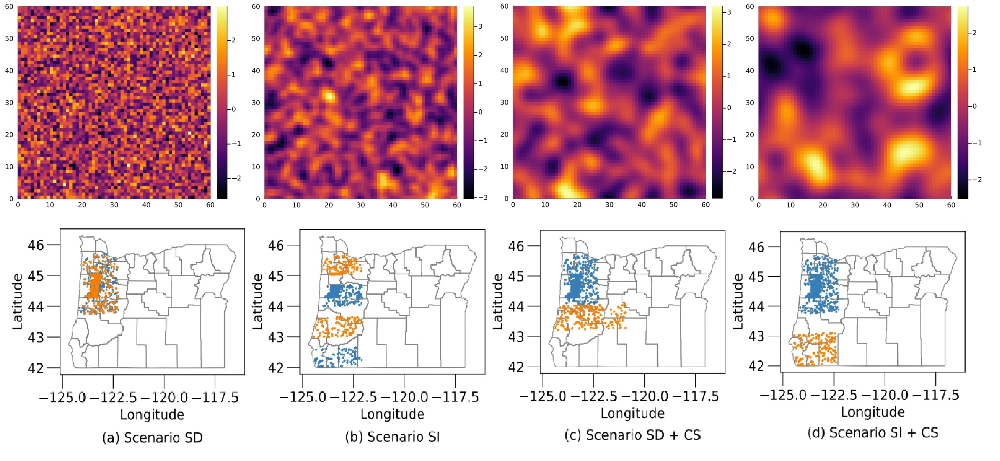
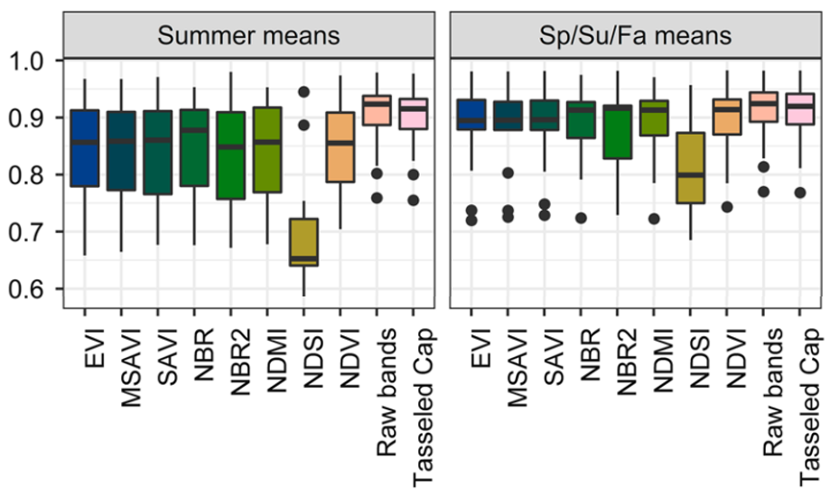
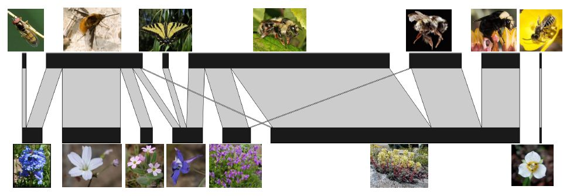

## Spatial Cross-validation for Geospatial Data

  

    
  

  

    Geospatial learning problems are frequently characterized by spatial autocorrelated input features and by the potential covariate shift at test time.
    These realities violate the classical iid assumption which most cross-validation methods rely on to estimate the generalization error. We investigate theoretical criteria for unbiased cross-validation estimators in the geospatial setting, develop a framework for choosing an appropriate strategy to estimate model error, and develop new cross-validation algorithms for challenging scenarios.
    Funded in part by the National Science Foundation (NSF) under Grant No. III-2046678 and by the United States Department of Agriculture National Institute of Food and Agriculture (USDA-NIFA) award No. 2021-67021-35344 (AgAID AI Institute)
  
  

## Environmental Predictors from Satellite Imagery

  

    
  

  

    Species distribution models (SDMs) generally require environmental variables as model inputs. It is common to use satellite imagery to derive the environmental variables, however, there are a number of methods for turning satellite data into environmental variables. We compare different methods for establishing environmental variables from satellite imagery. Specifically, we evaluate 1) summarizing the raw bands and transformations and/or indices of the raw bands (e.g., Tasseled Cap transformations, NDVI, EVI) and 2) directly analyzing the satellite imagery with convolutional neural networks (CNNs).
Funded in part by the National Aeronautics and Space Administration (NASA) under Future Investigators in NASA Earth and Space Science and Technology (FINESST) Grant No. 80NSSC20K1664.
  
  

## Spatial Clustering for Species Distribution Modeling from Community Science Data

  

    
  

  

    This project explores how developments in spatial clustering methods may help leverage broad scale community science data for building species distribution models (SDMs). Community science data span spatial and temporal scales unachievable by expert surveys alone, but they lack the structure imposed in smaller scale studies to allow adjustments for observational biases. Spatial clustering approaches can construct the necessary structure after surveys have occurred, but we are working to ensure that they are effective for this purpose. 
Funded in part by the National Science Foundation (NSF) under Grant No. III-2046678.
  
  

## Machine Learning Tools for Ecological Network Link Prediction

  

    
  

  

    Plant-pollinator interaction networks are bipartite networks representing the mutualistic interactions between a set of plant species and a set of pollinator species. Data on these networks are collected by field biologists, who count visits from
pollinators to flowers. Ecologists study the structure and function of these networks for scientific, conservation, and agricultural purposes. Our work investigates how matrix and tensor factorization techniques can help elucidate the structure of these imperfectly observed networks and aid predictions about new potential links.
Funded in part by the National Science Foundation (NSF) under Grant No. III-1910118.
  
  

<!-- ## Spatial Cross-validation for Geospatial Data

Geospatial learning problems are frequently characterized by spatial autocorrelated input features and by the potential covariate shift at test time.
These realities violate the classical iid assumption which most cross-validation methods rely on to estimate the generalization error. We investigate theoretical criteria for unbiased cross-validation estimators in the geospatial setting, develop a framework for choosing an appropriate strategy to estimate model error, and develop new cross-validation algorithms for challenging scenarios.
Funded in part by the National Science Foundation (NSF) under Grant No. III-2046678 and by the United States Department of Agriculture National Institute of Food and Agriculture (USDA-NIFA) award No. 2021-67021-35344 (AgAID AI Institute)

 -->
<!-- ## Environmental Predictors from Satellite Imagery

Species distribution models (SDMs) generally require environmental variables as model inputs. It is common to use satellite imagery to derive the environmental variables, however, there are a number of methods for turning satellite data into environmental variables. We compare different methods for establishing environmental variables from satellite imagery. Specifically, we evaluate 1) summarizing the raw bands and transformations and/or indices of the raw bands (e.g., Tasseled Cap transformations, NDVI, EVI) and 2) directly analyzing the satellite imagery with convolutional neural networks (CNNs).
Funded in part by the National Aeronautics and Space Administration (NASA) under Future Investigators in NASA Earth and Space Science and Technology (FINESST) Grant No. 80NSSC20K1664. 

## Spatial Clustering for Species Distribution Modeling from Community Science Data

This project explores how developments in spatial clustering methods may help leverage broad scale community science data for building species distribution models (SDMs). Community science data span spatial and temporal scales unachievable by expert surveys alone, but they lack the structure imposed in smaller scale studies to allow adjustments for observational biases. Spatial clustering approaches can construct the necessary structure after surveys have occurred, but we are working to ensure that they are effective for this purpose. 
Funded in part by the National Science Foundation (NSF) under Grant No. III-2046678.

  

## Machine Learning Tools for Ecological Network Link Prediction

Plant-pollinator interaction networks are bipartite networks representing the mutualistic interactions between a set of plant species and a set of pollinator species. Data on these networks are collected by field biologists, who count visits from
pollinators to flowers. Ecologists study the structure and function of these networks for scientific, conservation, and agricultural purposes. Our work investigates how matrix and tensor factorization techniques can help elucidate the structure of these imperfectly observed networks and aid predictions about new potential links.
Funded in part by the National Science Foundation (NSF) under Grant No. III-1910118.

 -->
