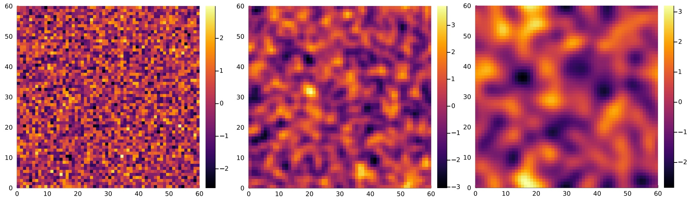

## Spatial Cross-validtion for Geospatial Data

Geostatistical learning problems are frequently characterized by spatial autocorrelation in the input features and/or the potential for covariate shift at test time.
These realities violate the classical assumption of independent, identically distributed data, upon which most cross-validation algorithms rely in order to estimate the generalization performance of a model. We investigate theoretical criteria for unbiased cross-validation estimators in the geospatial setting and develop a framework for choosing an appropriate strategy to estimate model error, and develop new cross-validation algorithms to evaluate and select models.

