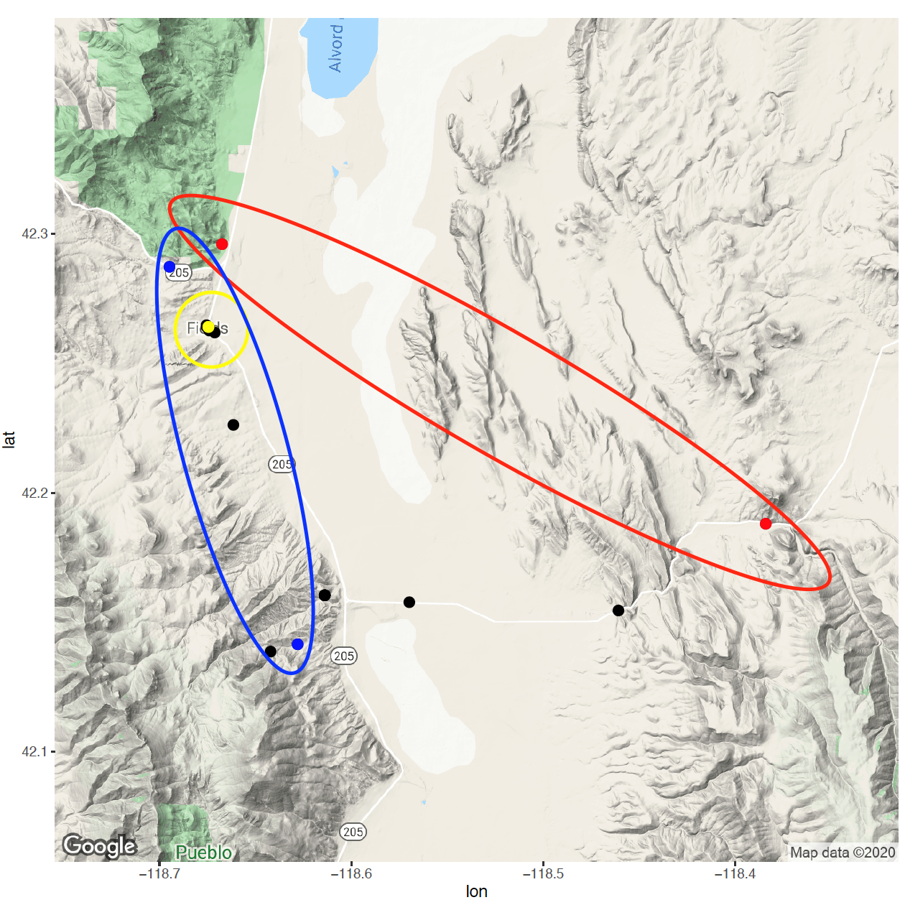

There are many options when establishing environmntal variables from satellite imagery. First, one must select a satellite dataset (e.g., Landsat, MODIS, Sentinel). Second is deciding how to summarize the data (i.e., how to turn satellite imagery into input feature vectors). With the many satellite imagery datasets and methods of summarization, there is an open question of which environmental variables are best suited for SDMs. To help address this question, we compared the predictive power of several sets of environmental variables derived from Landsat satellite imagery in predicting 13 bird species across the state of Oregon, USA. This work was done in collaboration with the [Oregon 2020 Project](https://oregon2020.com/) and was published in [Landscape Ecology](https://link.springer.com/article/10.1007/s10980-022-01406-y). 

## Background

Landsat imagery is a common source for environmental variables in species modeling. When working with Landsat (or any satellite) data, it is common to work with the
multispectral bands, transformations of the bands, or indices derived from the bands. Indices are single bands that are computed from different subsets of the multispectral bands and represent physical attributes of the landscape. The raw bands, Tasseled Cap transformation of the bands, and indices have all been shown to predict species well. It is common to establish environmental variables from satellite imagery for SDMs by computing statistics over specified areas centered at species sightings. This can be done for a single scale (e.g., 50m radius) or multiple scales (e.g., 50m, 100m, & 500m radii). Similarly, calculations can be made for a single season (e.g., the breeding season) or over multiple seasons. In addition to quantifying temporal variation, spatial variation in the landscape can be characterized through texture metrics, such as the gray level cooccurrence matrix (GLCM) analysis.

## Experimental Design
Our primary objectives were to:
1. Identify which of the spectral bands, indices, or transformations of spectral bands consistently informed the highest performing SDMs across several bird species
2. Examine whether data from additional seasons improved SDM performance
3. Explore whether standard deviations or textural metrics improved SDM performance
To answer the above questions, we modeled 13 bird species in the state of Oregon with different spectral predictor sets (i.e., sets of input variables)

### Spectral predictor sets
We developed spectral predictor sets based on previous SDM studies. Specifically, we analyzed the multispectral bands, their associated Tasseled Cap transformations, and eight single-valued indices derived from the spectral bands: NDMI, NDVI, NBR, NBR2, EVI, SAVI, MSAVI, NDSI. We computed the mean,
standard deviation, and GLCM texture metrics at three buffered radii (75, 600, and 2400m) centered at the count location for spring, summer, and fall imagery. We selected buffer sizes that have been previously shown to predict songbirds well in the state of Oregon.

### Species data
We used bird surveys obtained through the Oregon 2020 project. To cover a range of habitats, we selected thirteen species which are known to occur in six common habitats in Oregon and selected generalists and specialists within each habitat.

### Model setup
Predicting species occurrences (detections vs. non-detections) can be considered a binary classification problem. Following Johnston et al. (2021), we used
balanced random forests to address the high class imbalance (significantly more nondetections). Balanced random forests sample the same number of detections and nondetections in each bootstrapped sample drawn for each tree.

### Evaluation
We split data into spatial blocks to address potential spatial autocorrelation and then evaluated models with 10-fold cross validation. We used area under the receiver operating characteristic curve (AUC) and computed 95% DeLong confidence intervals to evaluate model performance.

    

<figure>
    
    <figcaption>Figure 1. Mean AUCs of the spectral predictor sets for each of the summary methods averaged across all 13 species. Black dots indicate outliers that fall outside the whiskers of the box plots.</figcaption>
</figure>

## Results
**Objective 1: Raw bands consistently informed the highest performing SDMs.** The raw bands was the top performing predictor set, with a mean AUC of 0.8990 (Figure 1 - Summer means). The next highest performing spectral predictor set, the Tasseled Cap transformation, did not statistically differ in performance from the raw bands (p-value = 0.9989, Nemenyi post-hoc Friedman). The highest performing index was NDVI which exhibited moderate evidence of being statistically different from the raw bands (p-value = 0.0709, Nemenyi post-hoc Friedman) with a mean AUC of 0.08485.

**Objective 2: Additional seasonal information did not improve SDM performance for the raw bands.** Adding summaries from spring and fall to the summer means spectral predictor sets had barely any impact on the top two performing summer means spectral predictor sets (raw bands and Tasseled Cap). However, the additional seasonal summaries led to an average increase of 0.0536 AUC for the single-index predictor sets (Figure 1 - Sp/Su/Fa means).

**Objective 3: Including standard deviations or texture metrics did not improve SDM performance for the raw bands.** Similar
to adding the seasonal summaries, there was only a small increase in model performance when adding standard deviations to the summer means for the top two performing spectral predictor sets (raw bands and Tasseled Cap) while the single-index predictor sets saw a 0.0424 increase in AUC (Figure 1 - Summer means & SDs). Similarly, adding the GLCM texture metrics to the summer means had only a small impact on the raw bands and Tasseled Cap models, but did have a significant impact on the single-index models with a 0.0811 increase in AUC (Figure 1 - Summer means & texture). Adding combinations of the additional seasons, standard deviations,
and texture metrics to the summer means did not have a significant impact on the raw-bands model (Figure 1 - Sp/Su/Fa means & texture; Summer means, SDs & texture; Sp/Su/Fa means, SDs & texture). 

## Conclusion 
We compared the predictive performance of different Landsat summary methods in building SDMs to help guide researchers through the many options faced when selecting remotely sensed data for SDMs. While our results are only based on 13 bird species in the state of Oregon, we chose species to represent a wide diversity of habitats and degrees of specialization. Our findings showed: (1) raw bands perform better than their summaries, (2) including additional seasons helps single-index models but has little effect on raw-bands or Tasseled- Cap models, and (3) including standard deviations or textural metrics helps single-index models but has little effect on raw-bands or Tasseled-Cap models. While our study was centered around SDMs, the workflow can be used as a template for performing similar comparisons of remotely sensed predictors for other tasks.
